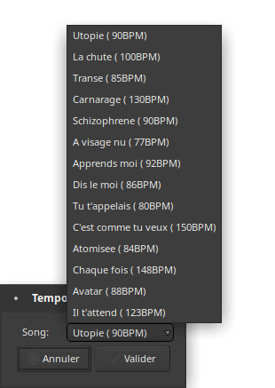

# Tempo template
This is a Ardour LUA script that makes it easy to set the tempo choosing from a customizable playlist.

# Usage
- Copy paste the script (.lua file) and the ".plst" file to the Ardour LUA script. Check [Ardour Manual](https://manual.ardour.org/lua-scripting) for details.
- If you are not running Ardour 5.x you should change the path to match your version in the .lua file (change the line containing "/.config/ardour5/scripts/tempo_template_playlist.plst")
- Restart Ardour
- Open the .plst file with a text editor and set it's content to match your requirements (i.e. song list with tempos. Each line must start with a song name and must be followed by a tempo in BPM separated by a comma)
- You now have "Tempo Template" in the Scripter window. When ran it will show your songs and BPMs.
- Click OK and it will set the tempo in the session at the playhead location
# Screenshot

